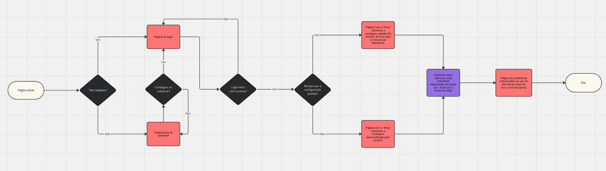

# Design Interface

## Flow User's

User flow (User Flow) is a technique that allows the developer to map all user navigation flow in the application. This technique works to align the paths and possible actions that the user can do together with the members of your team.

## Prototype

Developing a prototype emerges as one of the most agile and cost-effective ways to validate an idea, concept or functionality. This allows interaction, evaluation, modification and approval of the main features of an interface before entering the development phase. Read article [Prototypes: low, medium or high fidelity?](https://medium.com/ladies-that-ux-br/prot%C3%B3tipos-baixa-m%C3%A9dia-ou-alta-fidelidade-71d897559135).

### Low fidelity prototype

Low fidelity prototypes present in a simplified way the interface design and the relationship between its pages, allowing evolution of the solution proposal. In this project, we will use them to support the validation of requirements and make changes to them, if necessary, for less impact on the coding of the application.

[Develop the main graphical interfaces of the application so that the functional requirements are contemplated in the proposed screens.]

[Add here the screens of your application with their proper titles.] 
 
> **Useful Links**:
> - [Prototypes vs Wireframes](https://www.nngroup.com/videos/prototypes-vs-wireframes-ux-projects/)
>- Tools:
>> - [Pencil](https://pencil.evolus.vn/)
>> - [MarvelApp](https://marvelapp.com/)
>> - [Phigma](https://www.figma.com/)

