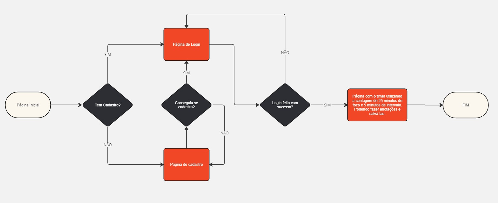
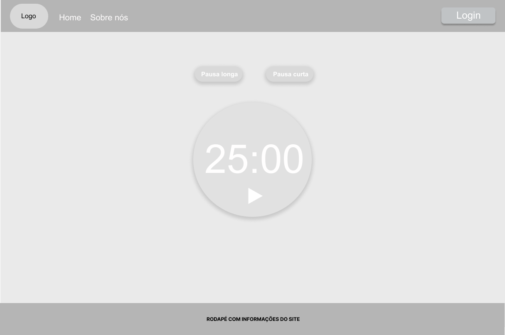
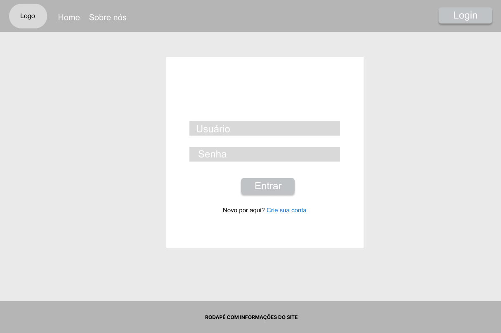
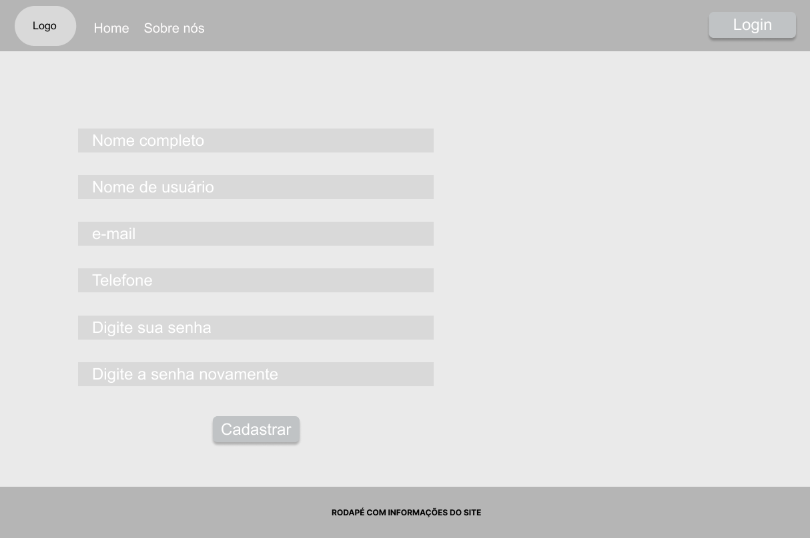
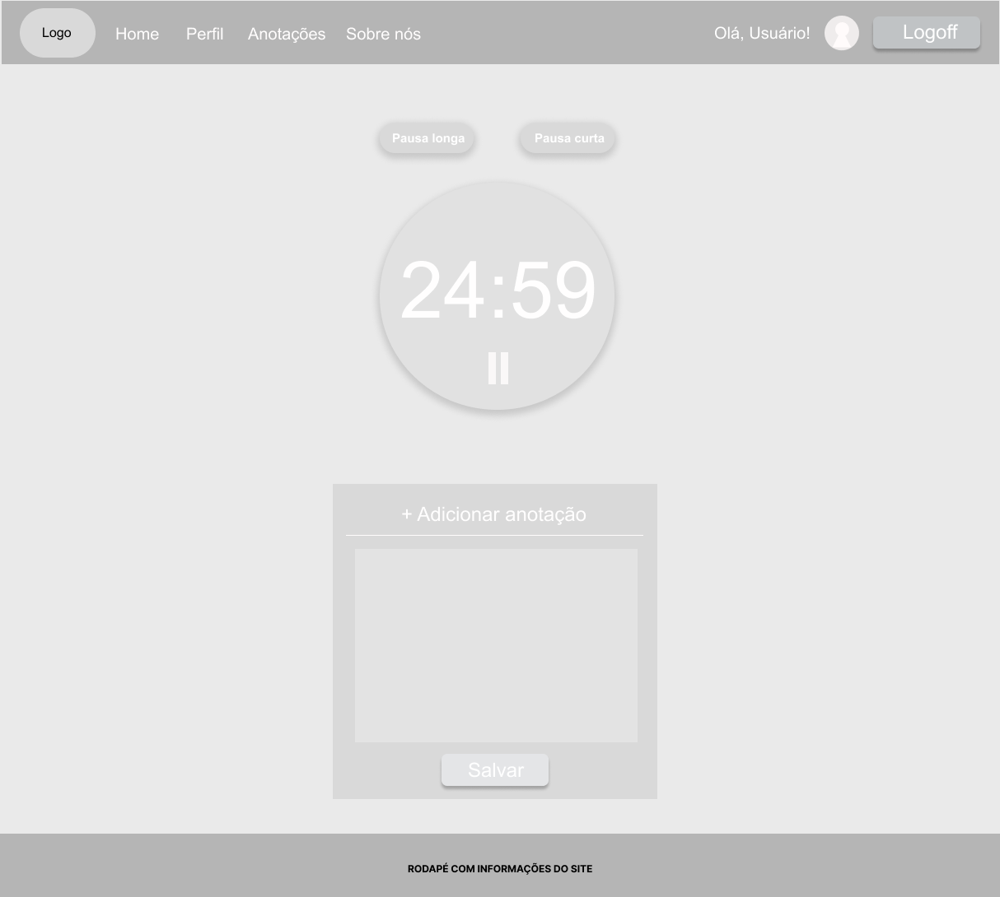
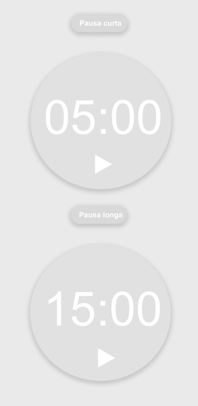

# Projeto de Interface

## User Flow
No esquema a seguir temos o fluxo de interação do usuário ao realizar o acesso ao site.  

## Protótipo

O protótipo a seguir exemplifica de forma gráfica a ideia inicial do desing do site e o relacionamento entre suas páginas.

### Protótipo de baixa fidelidade

### Página inicial

Na home page os visitantes do site que optarem por não efetuar o login terão acesso limitado às funcionalidades, podendo apenas utilizar o cronômetro Pomodoro. No entanto, os usuários que estiverem logados poderão fazer anotações diretamente no site e salvá-las para consulta posterior.

### Página de login

A página de Login oferece a opção para o usuário acessar o sistema ou a opção de realizar o cadastro.

### Formulário de Cadastro

Na página do formulário de cadastro são coletadas as informações básicas do usuário.

 
### Página inicial após o login/cadastro

Após o login/cadastro o usuário retorna para a pagina inicial do cronômetro com a funcionalidade de realizar anotações.

### Variações de marcação no cronômetro

A seguir temos um exemplo do cronometro quando o usuário seleciona as opções de pausa.

> **Links Úteis**:
> - [Protótipos vs Wireframes](https://www.nngroup.com/videos/prototypes-vs-wireframes-ux-projects/)
>- Ferramentas:
>> - [Pencil](https://pencil.evolus.vn/)
>> - [MarvelApp](https://marvelapp.com/)
>> - [Figma](https://www.figma.com/)

