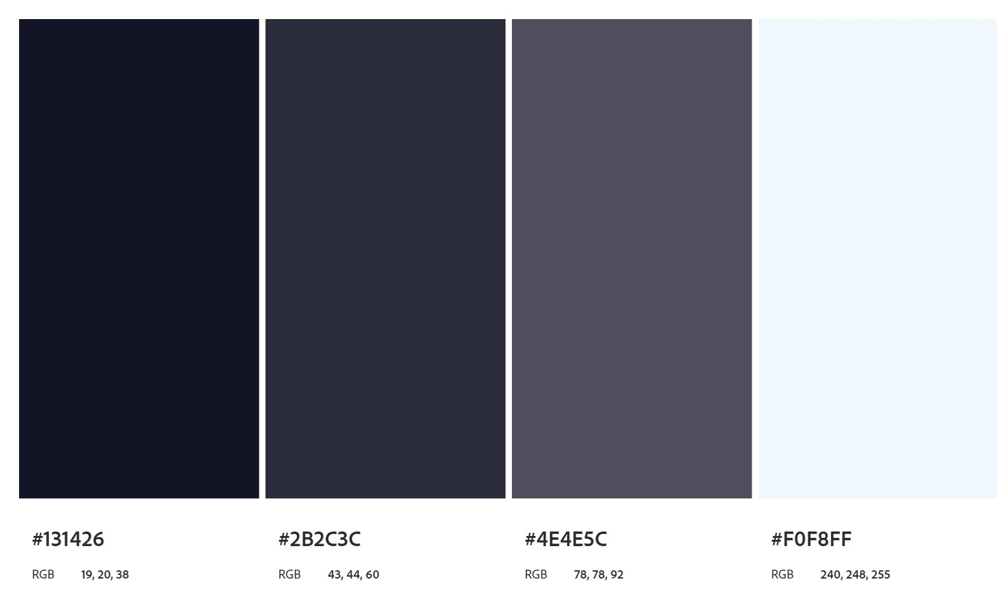
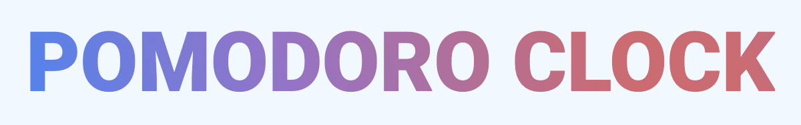

# Template padrão da Aplicação

O Layout padrão do site foi construído com HTML, CSS e JavaScript.

As páginas possuem, por padrão, o menu superior em todas as páginas de navegação realizadas pelo usuário, posssuindo também as mesmas cores, com a finalidade de dar padronização a todo o ambiente de uso.

# Paleta de cores

</img>

# Font-family

As fontes escolhidas foram "Roboto" e "sans-serif"

# Iconografia

Os icones foram usados do seguinte endereço: <a href="https://icons.getbootstrap.com/?q=home">https://icons.getbootstrap.com/?q=home</a>

* Home: "bi bi-house", <svg xmlns="http://www.w3.org/2000/svg" width="16" height="16" fill="currentColor" class="bi bi-house" viewBox="0 0 16 16">
  <path d="M8.707 1.5a1 1 0 0 0-1.414 0L.646 8.146a.5.5 0 0 0 .708.708L2 8.207V13.5A1.5 1.5 0 0 0 3.5 15h9a1.5 1.5 0 0 0 1.5-1.5V8.207l.646.647a.5.5 0 0 0 .708-.708L13 5.793V2.5a.5.5 0 0 0-.5-.5h-1a.5.5 0 0 0-.5.5v1.293zM13 7.207V13.5a.5.5 0 0 1-.5.5h-9a.5.5 0 0 1-.5-.5V7.207l5-5z"/>
</svg>

* Tarefas: "bi bi-card-checklist", <svg xmlns="http://www.w3.org/2000/svg" width="16" height="16" fill="currentColor" class="bi bi-card-checklist" viewBox="0 0 16 16">
  <path d="M14.5 3a.5.5 0 0 1 .5.5v9a.5.5 0 0 1-.5.5h-13a.5.5 0 0 1-.5-.5v-9a.5.5 0 0 1 .5-.5zm-13-1A1.5 1.5 0 0 0 0 3.5v9A1.5 1.5 0 0 0 1.5 14h13a1.5 1.5 0 0 0 1.5-1.5v-9A1.5 1.5 0 0 0 14.5 2z"/>
  <path d="M7 5.5a.5.5 0 0 1 .5-.5h5a.5.5 0 0 1 0 1h-5a.5.5 0 0 1-.5-.5m-1.496-.854a.5.5 0 0 1 0 .708l-1.5 1.5a.5.5 0 0 1-.708 0l-.5-.5a.5.5 0 1 1 .708-.708l.146.147 1.146-1.147a.5.5 0 0 1 .708 0M7 9.5a.5.5 0 0 1 .5-.5h5a.5.5 0 0 1 0 1h-5a.5.5 0 0 1-.5-.5m-1.496-.854a.5.5 0 0 1 0 .708l-1.5 1.5a.5.5 0 0 1-.708 0l-.5-.5a.5.5 0 0 1 .708-.708l.146.147 1.146-1.147a.5.5 0 0 1 .708 0"/>
</svg>

* Login/Logout: "bi bi-box-arrow-right", <svg xmlns="http://www.w3.org/2000/svg" width="16" height="16" fill="currentColor" class="bi bi-box-arrow-right" viewBox="0 0 16 16">
  <path fill-rule="evenodd" d="M10 12.5a.5.5 0 0 1-.5.5h-8a.5.5 0 0 1-.5-.5v-9a.5.5 0 0 1 .5-.5h8a.5.5 0 0 1 .5.5v2a.5.5 0 0 0 1 0v-2A1.5 1.5 0 0 0 9.5 2h-8A1.5 1.5 0 0 0 0 3.5v9A1.5 1.5 0 0 0 1.5 14h8a1.5 1.5 0 0 0 1.5-1.5v-2a.5.5 0 0 0-1 0z"/>
  <path fill-rule="evenodd" d="M15.854 8.354a.5.5 0 0 0 0-.708l-3-3a.5.5 0 0 0-.708.708L14.293 7.5H5.5a.5.5 0 0 0 0 1h8.793l-2.147 2.146a.5.5 0 0 0 .708.708z"/>
</svg>

# Logo

Para a logo foi escolhido apenas usar o nome do site mantendo um aspecto minimalista, a fonte usada foi a "Roboto", colorida com o gradiente das cores #4285f4; #9b72cb; e #d96570;

</img>

> **Links Úteis**:
>
> - [CSS Website Layout (W3Schools)](https://www.w3schools.com/css/css_website_layout.asp)
> - [Website Page Layouts](http://www.cellbiol.com/bioinformatics_web_development/chapter-3-your-first-web-page-learning-html-and-css/website-page-layouts/)
> - [Perfect Liquid Layout](https://matthewjamestaylor.com/perfect-liquid-layouts)
> - [How and Why Icons Improve Your Web Design](https://usabilla.com/blog/how-and-why-icons-improve-you-web-design/)
