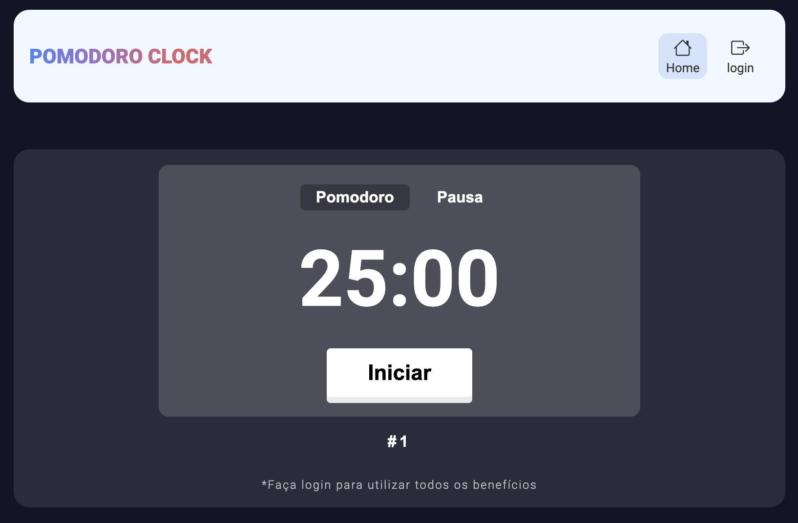
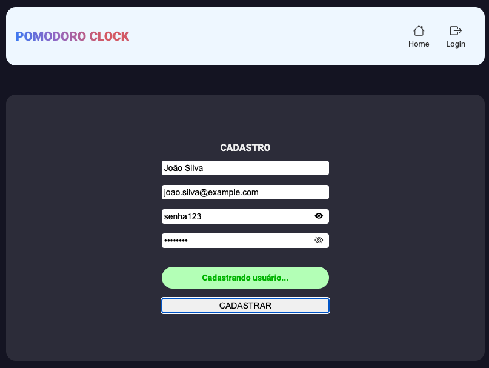
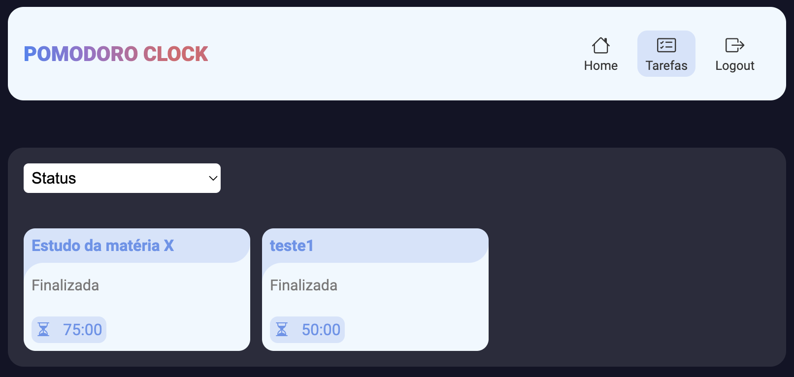

# Programação de Funcionalidades

### Relógio Pomodoro

 

#### Requisito atendido

* RF-03	O “Pomodoro” deve permitir que o usuário tenha acesso e visualize o cronômetro.
* RF-04	O “Pomodoro” deve permitir ao usuário definir o tempo do cronômetro (para concentração e descanso).
* RF-05	O “Pomodoro” deve alertar o usuário ao término do tempo proposto.
* RF-06	O “Pomodoro” deve permitir ao usuário montar um planejamento de estudos.

#### Artefatos da funcionalidade

* home.html
* index.js

#### Instruções de acesso

O usuário poderá configurar os ciclos pomodoros de 25 minutos com intervalo de 5 minutos para descanso. Ao clicar em "Adicionar tarefa" o usuário irá descrever qual a finalidade daquela seção, após isso irá definir no campo abaixo o numero de cilcos e clicar em salvar. Feito isso o usuário irá clicar em iniciar para começar a contar o tempo.

### Cadastro de usuário

#### Requisito atendido

* RF-01	O “Pomodoro” deve permitir ao usuário cadastrar uma conta.

#### Artefatos da funcionalidade

* cadastro.html
* auth.js

#### Instruções de acesso

usuário irá preencher as informações de: nome, e-mail e senha para realizar o cadastro, após isso ele é direcionado para a página inicial para usar o relógio Pomodoro.

### Cadastro de usuário

#### Requisito atendido

* RF-02	O “Pomodoro” deve permitir que o usuário acesse uma conta cadastrada.

#### Artefatos da funcionalidade

* login.html
* auth.js

#### Instruções de acesso

usuário irá usar as informações de: e-mail e senha utilizadas para realizar o cadastro.

### Cadastro de usuário

#### Ciclos Pomodoros salvos

* RF-07	O “Pomodoro” deve permitir ao usuário acessar e visualizar sua rotina de estudos.
* RF-09	O “Pomodoro” deve permitir ao usuário dar um feedback sobre seu uso ao final do ciclo.

#### Artefatos da funcionalidade

* anotacoes.html
* anotacoes.js

#### Instruções de acesso

O usuário após teminar o ciclo de Pomodoro, poderá vizualizar os ciclos finalizados e os ciclos que estão pendentes acessando, na canto superior direito da página, a opção "Tarefas" para visualizar e controlar suas atividades.

> **Links Úteis**:
> - [Trabalhando com HTML5 Local Storage e JSON](https://www.devmedia.com.br/trabalhando-com-html5-local-storage-e-json/29045)
> - [JSON Tutorial](https://www.w3resource.com/JSON)
> - [JSON - Introduction (W3Schools)](https://www.w3schools.com/js/js_json_intro.asp)
> - [JSON Tutorial (TutorialsPoint)](https://www.tutorialspoint.com/json/index.htm)

